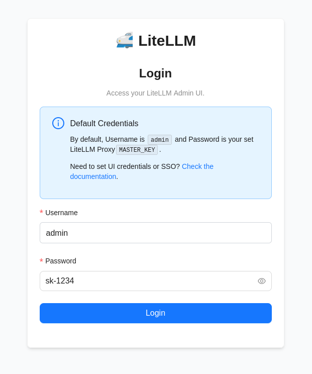
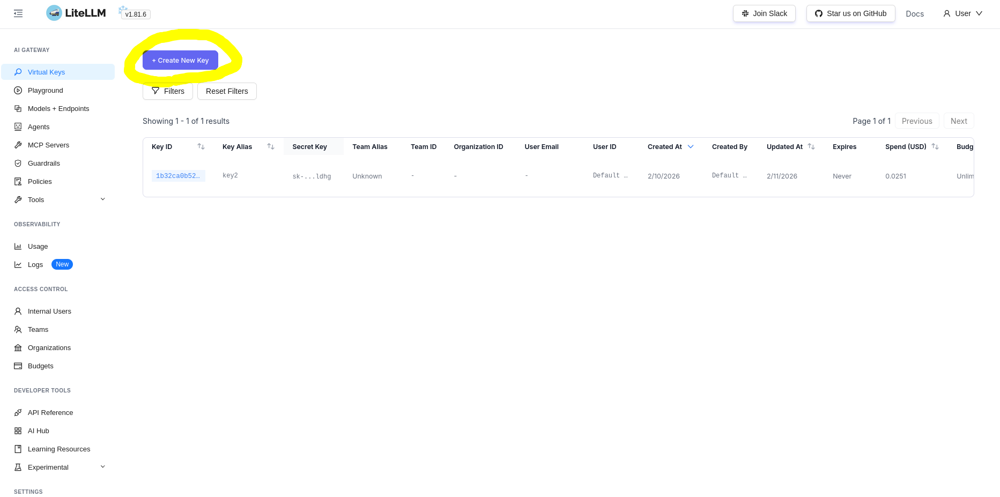
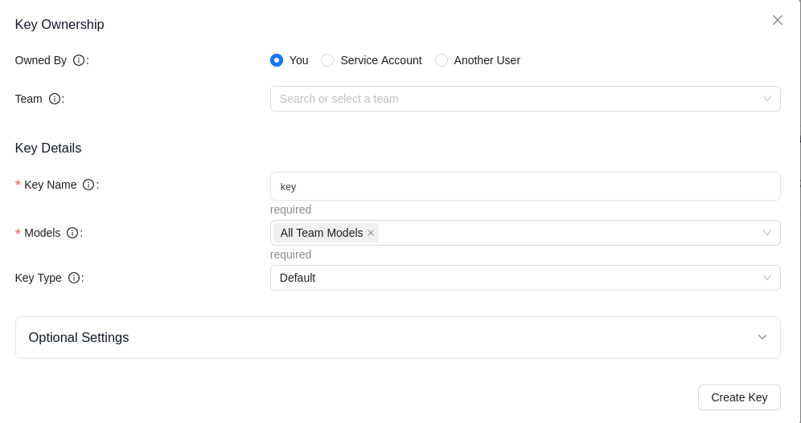
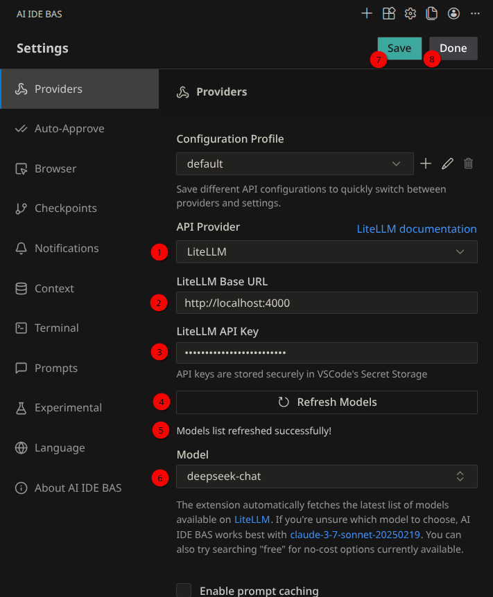
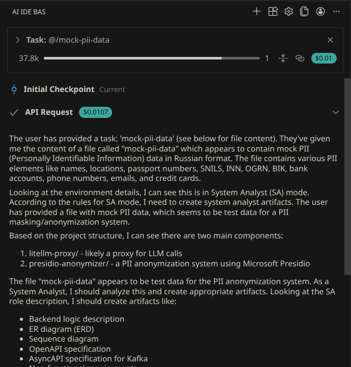
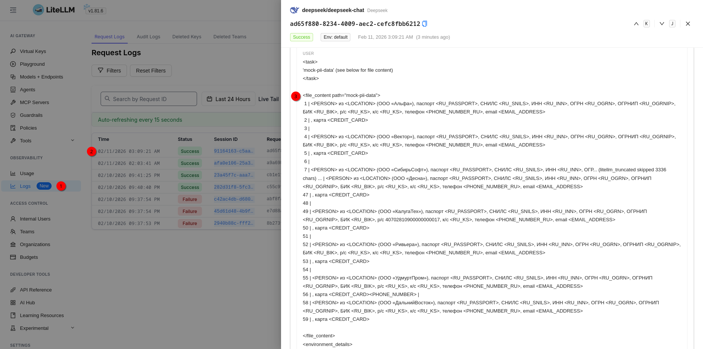

<style>
img {
    border-radius: 10px;
}
</style>

# Personal Identity Information masking proxy server

## Get the repository
```
git clone --depth=1 https://github.com/dradns/AI-IDE-BAS.git 
cd pii-masking-proxy
```

## Configure LiteLLM proxy
- Go to *litellm-proxy* folder
- Configure LiteLLM proxy using *config.yaml* file
  - Full documentation: https://docs.litellm.ai/docs/proxy/configs
- Create *.env* file
- Specify API keys according to the *config.yaml* (see also *.env.example*)

## Run the service
```
docker compose up
```

## Integrate with AI IDE BAS extension
### Get the LiteLLM API KEY
- Go to `http://localhost:4000/ui`
- Log in to the admin panel

<br>
<br>

- Click **Create New Key**



- Choose the following options



- Click **Create Key** and save it somewhere safe
- Go to VSCode: **File -> Open Folder...**
- Open the containing folder

### Go to AI IDE BAS extension
1. Choose *LiteLLM* **API Provider**
2. Enter proxy **Base URL**
3. Paste **LiteLLM API KEY** 
4. Get available models
5. You should see "Models list refreshed successfully!"
6. Choose the needed model from the dropdown
7. Save changes
8. Finish configuration




### Try to mask mock-pii-data.txt provided file



### Check it out
1. Go to logs section
2. Choose the last request
3. See the result


