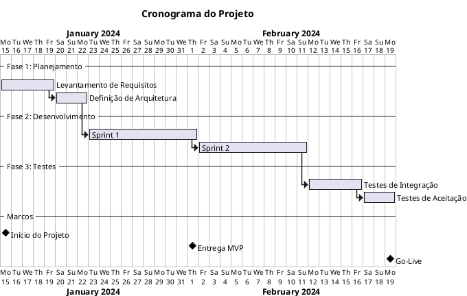
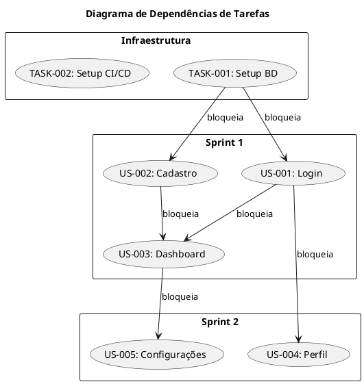

### 4.3. Gestão de Backlog e Sprints
**Instruções para Gestão de Projeto para Agente de IA**

#### 4.3.1. Conteúdo
1. [Backlog de Sprint](#backlog-de-sprint)
2. [Formulação de Tarefas](#formulação-de-tarefas)
3. [Priorização](#priorização)
4. [Diagrama de Gantt](#diagrama-de-gantt)
5. [Diagrama de Dependências](#diagrama-de-dependências)
6. [Checklists de Qualidade](#checklists-de-qualidade)

---

#### 4.3.2. Backlog de Sprint

##### 4.3.2.1. Estrutura do Backlog:

# Sprint Backlog - Sprint [Número]

## Informações da Sprint
- **Período**: [data início] - [data fim]
- **Objetivo da Sprint**: [descrição clara do objetivo]
- **Capacidade da Equipe**: [story points ou horas]

## Itens do Backlog

| ID | Título | Tipo | Prioridade | Estimativa | Responsável | Status |
|----|--------|------|------------|------------|-------------|--------|
| US-001 | [Título] | User Story | Alta | 5 SP | [Nome] | A Fazer |
| TASK-001 | [Título] | Tarefa | Média | 3 SP | [Nome] | Em Progresso |

## Critérios de Sucesso da Sprint
- [ ] Critério 1
- [ ] Critério 2

## Riscos Identificados
| Risco | Probabilidade | Impacto | Mitigação |
|-------|---------------|---------|-----------|
| [Risco] | [A/M/B] | [A/M/B] | [Ação] |

##### 4.3.2.2. Tipos de Itens:

| Tipo | Descrição | Prefixo |
|------|-----------|---------|
| User Story | Requisito de negócio | US- |
| Tarefa | Trabalho técnico | TASK- |
| Bug | Correção de defeito | BUG- |
| Spike | Investigação/PoC | SPIKE- |
| Melhoria | Otimização | IMP- |

---

#### 4.3.3. Formulação de Tarefas

##### 4.3.3.1. Template de Tarefa:

## TASK-XXX: [Título Descritivo]

### Descrição
[Descrição clara do que precisa ser feito]

### Contexto
- **User Story Relacionada**: US-XXX
- **Sprint**: Sprint [N]
- **Responsável**: [Nome]

### Critérios de Aceitação
- [ ] Critério 1
- [ ] Critério 2
- [ ] Critério 3

### Detalhes Técnicos
[Informações técnicas relevantes]

### Dependências
- Bloqueado por: [TASK-YYY]
- Bloqueia: [TASK-ZZZ]

### Estimativa
- **Story Points**: [N]
- **Horas estimadas**: [N]h

### Notas Adicionais
[Informações adicionais relevantes]

##### 4.3.3.2. Princípios de Boa Formulação:
- **Específico**: Descreva exatamente o que precisa ser feito
- **Mensurável**: Inclua critérios de aceitação verificáveis
- **Atingível**: Considere capacidade e recursos disponíveis
- **Relevante**: Conecte com objetivos do projeto
- **Temporal**: Estime duração realista

##### 4.3.3.3. Checklist de Formulação:
- [ ] Título claro e descritivo
- [ ] Descrição suficiente para entendimento
- [ ] Critérios de aceitação definidos
- [ ] Estimativa incluída
- [ ] Dependências identificadas
- [ ] Responsável atribuído

---

#### 4.3.4. Priorização

##### 4.3.4.1. Método MoSCoW:

| Categoria | Descrição | Exemplo |
|-----------|-----------|---------|
| **Must Have** | Essencial, sem isso o projeto falha | Autenticação de usuário |
| **Should Have** | Importante, mas não crítico | Notificações por email |
| **Could Have** | Desejável, se houver tempo | Temas personalizados |
| **Won't Have** | Fora do escopo desta fase | Integração com redes sociais |

##### 4.3.4.2. Matriz de Priorização:

# Matriz de Priorização

## Must Have (Crítico)
| ID | Título | Justificativa |
|----|--------|---------------|
| US-001 | [Título] | [Por que é crítico] |

## Should Have (Importante)
| ID | Título | Justificativa |
|----|--------|---------------|
| US-005 | [Título] | [Por que é importante] |

## Could Have (Desejável)
| ID | Título | Justificativa |
|----|--------|---------------|
| US-010 | [Título] | [Por que é desejável] |

## Won't Have (Fora do Escopo)
| ID | Título | Motivo |
|----|--------|--------|
| US-015 | [Título] | [Por que não será feito] |

##### 4.3.4.3. Critérios de Priorização:
- **Valor de Negócio**: Impacto no cliente/negócio
- **Risco Técnico**: Complexidade e incerteza
- **Dependências**: O que bloqueia outras tarefas
- **Esforço**: Custo de implementação
- **Urgência**: Restrições de tempo

---

#### 4.3.5. Diagrama de Gantt

##### 4.3.5.1. Formato PlantUML:

##### 4.3.5.2. Formato Markdown:

# Cronograma do Projeto

## Visão Geral

| Fase | Início | Fim | Duração |
|------|--------|-----|---------|
| Planejamento | 15/01 | 22/01 | 8 dias |
| Desenvolvimento | 23/01 | 11/02 | 20 dias |
| Testes | 12/02 | 19/02 | 8 dias |

## Detalhamento por Semana

### Semana 1 (15/01 - 19/01)
- [ ] Levantamento de Requisitos
- [ ] Entrevistas com Stakeholders

### Semana 2 (22/01 - 26/01)
- [ ] Definição de Arquitetura
- [ ] Início Sprint 1

## Marcos do Projeto

| Marco | Data | Critério de Sucesso |
|-------|------|---------------------|
| Início do Projeto | 15/01 | Kick-off realizado |
| MVP | 02/02 | Funcionalidades core implementadas |
| Go-Live | 19/02 | Sistema em produção |

---

#### 4.3.6. Diagrama de Dependências

##### 4.3.6.1. Formato PlantUML:

##### 4.3.6.2. Formato Markdown:

# Diagrama de Dependências

## Legenda
- **→** : "bloqueia" / "é pré-requisito para"
- **⇄** : "depende mutuamente"

## Dependências por Item

### TASK-001: Setup do Banco de Dados
**Bloqueia:**
- US-001: Login
- US-002: Cadastro

### US-001: Login
**Bloqueado por:**
- TASK-001: Setup do Banco de Dados

**Bloqueia:**
- US-003: Dashboard
- US-004: Perfil de Usuário

### US-002: Cadastro de Usuário
**Bloqueado por:**
- TASK-001: Setup do Banco de Dados

**Bloqueia:**
- US-003: Dashboard

## Caminho Crítico
1. TASK-001 → US-001 → US-003 → US-005

## Matriz de Dependências

|     | TASK-001 | US-001 | US-002 | US-003 | US-004 | US-005 |
|-----|----------|--------|--------|--------|--------|--------|
| TASK-001 | - | → | → | | | |
| US-001 | ← | - | | → | → | |
| US-002 | ← | | - | → | | |
| US-003 | | ← | ← | - | | → |
| US-004 | | ← | | | - | |
| US-005 | | | | ← | | - |

---

#### 4.3.7. Checklists de Qualidade

##### 4.3.7.1. Checklist de Sprint Planning:
- [ ] Objetivo da sprint definido e claro
- [ ] Capacidade da equipe calculada
- [ ] Itens do backlog priorizados
- [ ] Estimativas completas para todos os itens
- [ ] Dependências identificadas
- [ ] Riscos avaliados
- [ ] Critérios de sucesso definidos

##### 4.3.7.2. Checklist de Tarefa:
- [ ] Título descritivo
- [ ] Descrição clara e completa
- [ ] Critérios de aceitação verificáveis
- [ ] Estimativa incluída
- [ ] Responsável atribuído
- [ ] Dependências mapeadas
- [ ] Vinculada a User Story (se aplicável)

##### 4.3.7.3. Checklist de Priorização:
- [ ] Todos os itens categorizados (MoSCoW)
- [ ] Justificativas documentadas
- [ ] Stakeholders consultados
- [ ] Dependências consideradas
- [ ] Capacidade respeitada

##### 4.3.7.4. Checklist de Cronograma:
- [ ] Todas as fases incluídas
- [ ] Marcos definidos
- [ ] Dependências refletidas
- [ ] Buffer para riscos incluído
- [ ] Recursos considerados
- [ ] Caminho crítico identificado

---

#### 4.3.8. Métricas de Projeto

##### 4.3.8.1. Métricas de Sprint:

| Métrica | Descrição | Alvo |
|---------|-----------|------|
| Velocity | Story points entregues por sprint | Consistente |
| Sprint Burndown | Progresso diário | Linear |
| Commitment Rate | % de itens comprometidos entregues | ≥ 80% |
| Bug Escape Rate | Bugs encontrados pós-sprint | < 10% |

##### 4.3.8.2. Métricas de Projeto:

| Métrica | Descrição | Alvo |
|---------|-----------|------|
| Schedule Variance | Desvio do cronograma | ≤ 10% |
| Scope Creep | Aumento de escopo | ≤ 15% |
| Resource Utilization | Uso de recursos | 80-90% |
| Defect Density | Defeitos por story point | Decrescente |
