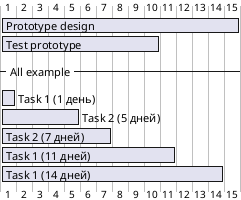
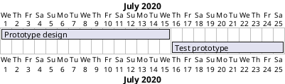
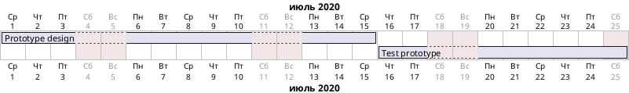
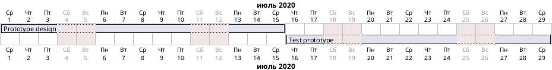
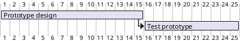
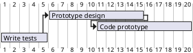
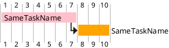

### 2. Основной контент
2.1 Обоснование ролей и оценка трудоемкости на основании артефактов SA 
Пример:
Для фичи "Платежный модуль" (payment_backend.md)

Роль
	Почему нужна?
	SP (мин-макс)
	Ссылки на артефакты
	Backend
	Реализация сложной логики переводов с валидацией, транзакциями и интеграциями
	8-13 SP
	payment_backend.md#logic, payment_openAPI.yaml
	Frontend
	Разработка UI для платежной формы (включая валидацию полей)
	3-5 SP
	payment_sequence.plantuml#ui-flow
	QA
	Тестирование 20+ сценариев (успешные/ошибочные/пограничные случаи)
	5-8 SP
	payment_backend.md#validation, *_nfr.md#test-cases
	DevOps
	Настройка мониторинга транзакций и алертинга
	3-5 SP
	*_nfr.md#monitoring
	Security
	Аудит безопасности платежных данных (PCI DSS)
	2-3 SP
	*_nfr.md#security
	

Метод оценки:
* 1 SP = 1 день работы middle-специалиста
* Диапазон: min (идеальные условия) - max (учет рисков)
2.2 Формулировка задач
Пример:

markdown

 TASK-101: Реализация ядра платежа  
**Роль**: Backend (8 SP)  
**Артефакты**:  
- Требования: `payment_backend.md#core-logic`  
- API: `payment_openAPI.yaml#paths:/transfer`  
**Критерии**:  
- [ ] Поддержка транзакций (commit/rollback)  
- [ ] Соответствие NFR (<500ms latency)  

2.3 Приоритезация 
Критерии приоритезации:

Фактор
	Вес
	Описание
	Reach
	30%
	Количество пользователей/транзакций
	Impact
	25%
	Влияние на бизнес-метрики
	Confidence
	20%
	Уверенность в оценках (50-100%)
	Effort
	25%
	Трудозатраты (SP)
	

Пример приоритизированного бэклога

ID
	Задача
	Роль
	SP
	Приоритет
	В спринт?
	Артефакты
	101
	Реализация ядра платежа
	Backend
	8
	P0
	✅
	payment_backend.md#core-logic
	102
	Интеграция с банковским API
	Backend
	5
	P0
	✅
	payment_openAPI.yaml#bank-api
	103
	UI платежной формы
	Frontend
	3
	P1
	✅
	payment_sequence.plantuml#ui
	104
	Настройка мониторинга
	DevOps
	3
	P1
	⚠️ (если время)
	*_nfr.md#monitoring
	105
	Аудит безопасности
	Security
	2
	P2
	❌
	*_nfr.md#security-audit
	

Пояснения:
* P0: Критично для запуска (бизнес-требование)
* P1: Важно, но можно отложить на 1-2 спринта
* P2: Низкий приоритет (оптимизации)

###3. Метрики качества
* Полнота: 100% задач ссылаются на артефакты СА
* Точность: ±2 SP к фактическим трудозатратам
###4. Источники и результаты

Входные данные: артефакты СА
Выходные данные: 
   /sprint_24-04
    /backlog_prioritized.md
    /gantt_chart.plantuml
    /dependencies.plantuml
    /risk_register.xlsx
    /team_capacity.md  # Распределение SP по ролям

###5. Правила создания
Для каждой задачи:
* Указать точные ссылки на артефакты СА
* Рассчитать min-max SP с обоснованием
Риски:
* Вероятность (20%/50%/80%
* Четкий триггер (напр. "ошибка 502 от API банка")
###6. Шаблоны
####6.1 Шаблон бэклога спринта

Файл: {project}_sprint_backlog.md

markdown
Бэклог спринта {Номер}  
**Даты:** {ГГГГ-ММ-ДД} – {ГГГГ-ММ-ДД}  
**Цель:** {Краткое описание цели спринта}  

 **Методология оценки**  
- **1 SP** ≈ 1 день работы middle-разработчика  
- **Диапазон min-max**:  
  - **Min**: Идеальные условия (нет блокеров, зависимости готовы)  
  - **Max**: Учет рисков (проблемы с интеграциями, доработки)  

 **Приоритезация (RICE)**  
| Фактор       | Вес  | Критерии оценки                     |  
|--------------|------|-------------------------------------|  
| **Reach**    | 30%  | Охват пользователей/транзакций      |  
| **Impact**   | 25%  | Влияние на бизнес-метрики           |  
| **Confidence** | 20% | Уверенность в оценке (50-100%)      |  
| **Effort**   | 25%  | Трудозатраты (min-max SP)           |  

 **Задачи**  
| ID  | Название                     | Роль          | SP (min-max) | Приоритет | Статус   | Артефакты                          |  
|-----|------------------------------|---------------|--------------|-----------|----------|------------------------------------|  
| 101 | Реализация ядра платежа      | Backend       | 8–13         | P0        | To Do    | `payment_backend.md#core-logic`    |  
| 102 | Интеграция с API банка       | Backend       | 5–8          | P0        | To Do    | `payment_openAPI.yaml#bank-api`    |  
| 103 | UI платежной формы           | Frontend      | 3–5          | P1        | To Do    | `payment_sequence.plantuml#ui`     |  

 **Общий план по SP**  
- **Оптимистичный (min):** 16 SP  
- **Реалистичный:** 21 SP  
- **Пессимистичный (max):** 26 SP  

 **Критерии завершения**  
-  Все задачи проходят acceptance-тесты  
-  Нет критических багов (Severity 1-2)  
-  Проведен demo-показ для стейкхолдеров  

#### 6.2 Шаблон задачи
markdown

TASK-{ID}: {Название}  
**Роль**: {Backend/Frontend/QA} ({SP} SP)  
**Артефакты**:  
- Требования: `{file}#{section}`  
- API: `{file}`  
**Риски**:  
- {Описание} (вероятность: {X}%, митрейшн: {действие})  

### 6.3 Шаблон Диаграммы Ганта
#### Инструкция по созданию диаграммы Ганта в PlantUML

##### Введение
    Диаграмма Ганта — инструмент для управления проектами, показывающий задачи по временной оси: даты начала/окончания, продолжительность, последовательности и пересечения задач. PlantUML предоставляет текстовый синтаксис для описания диаграмм Ганта, что удобно для контроля версий и автоматической генерации. 

##### Требования и порядок генерации диаграммы в PlantUML
1. Во ремя создания диаграммы применять принцип KISS (Keep It Simple, Stupid или Keep It Short and Simple) - это фундаментальный принцип проектирования и разработки, согласно которому большинство систем работают лучше всего, когда они остаются простыми, а не усложняются излишне
2. При генерации диаграммы руководствоваться следующим:
- данной инструкцией
- примерами, описанными по ссылке: https://plantuml.com/ru/gantt-diagram
- отклоняться от данной инструкции и примеров запрещено
   

##### Действия, которые необходимо сделать на основании ответов пользователя:
1. Указанную пользователем дату начала проекта необходимо преобразовать в формат `YYYY-MM-DD` (пример: `2025-09-25`) и указать после `Project starts` (пример:`Project starts 2025-09-25`)
   

##### Основы синтаксиса

- Диаграмма начинается и заканчивается блоком `@startgantt` / `@endgantt`.
- Задачи объявляются в квадратных скобках: `[Task name]`.
- В наименовании задачи должно быть указано [Наименование ([дней] дня либо дней)]

###### Объём работы
Для задания продолжительности используется глагол `requires`:

> Примечание: неделя обычно 7 дней, но при "закрытых" днях (выходных) неделя может интерпретироваться как 5 рабочих дней.

###### Начало (start)

- Дата начала устанавливается с помощью `start` (абсолютная дата)
- Запрещено использовать относительную дату D+N

###### Окончание (end)

- Дата окончания задаётся через `ends`:
- Запрещено использовать относительное окончание в формате D+N

###### Одновременное задание начала и окончания (Start/End)

Можно задать сразу `starts` и `ends` для задачи:

---

###### Однострочное объявление (with `and`)

Можно объединить объявление в одну строку с помощью `and`:

---

###### Ограничения между задачами (Dependencies)

Добавление ограничений:

Пример цепочки:

---

###### Псевдонимы задач (`as`)

Короткие имена (алиасы):

---

###### Задачи с одинаковыми именами

Начиная с версии V1.2024.6 можно создавать задачи с одинаковыми отображаемыми именами, задавая для каждой отдельный алиас:

```plantuml
@startgantt
Project starts 2020-11-08
[Task 7 days] as [T7] starts at 2020-11-09
[T7] ends at 2020-11-15
[Task 7 days] as [T7bis] starts at 2020-11-09
[T7bis] ends at 2020-11-15
@endgantt
```

Или пример с цветами/зависимостью:

###### Заголовок диаграммы
- Необходимо добавить заголовок к диаграмме: `title 'Диаграмма Ганта ([Наименование проекта])'`

Пример:

---
##### Критерии качества:

1. Получен ответ от пользователя о дате начала проекта
2. Не использовать цвета `LightCyan` и `LightYellow` при указании `is colored in`
3. Запрещено использовать в коде комбинации `start + [количество] days` например `start + 14 days`
4. При генерации диаграммы руководствоваться следующим:
   - данной инструкцией
   - примерами, описанными по ссылке: https://plantuml.com/ru/gantt-diagram
   - отклоняться от данной инструкции и примеров запрещено
5. Не испаользовать `section` 
6. Все секции именовать как `--**Секция**--`, и разделить на следующие части:
   - Сбор и анализ требований
   - Проектирование архитектуры
   - Разработка
   - Интеграции
   - Тестирование
   - Внедрение
   - Риски проекта
   - Вехи проекта
7. Секцию `--**Зависимости**--` в коде именовать в виде комментария `' Зависимости`
8. В диаграмме должны быть указаны: `Основные задачи` и `Риски`
9. Перед сохранением необходимо проверить на строгое соответсвие данному документу и PlantUML
10. Файлы именуются следующим образом:
- Указано значение `printscale` как `printscale daily zoom 2`в файле:`[Наименование проекта]_[Наименование диаграммы]_[Версия документа в формате: v_[минор]_[мажор]_[патч]]_dayly_[язык диаграммы].puml`
- Указано значение `printscale` как `printscale printscale weekly zoom 1`в файле:`[Наименование проекта]_[Наименование диаграммы]_[Версия документа в формате: v_[минор]_[мажор]_[патч]]_weekly_[язык диаграммы].puml`

   

#### 6.4 Шаблон диаграммы зависимостей

Файл: {project}_dependencies.plantuml

plantuml

@startuml {project}_dependencies

title Диаграмма зависимостей - {Название проекта}
' Версия: {Версия}
' Автор: {ФИО}

skinparam monochrome true
skinparam arrowColor #2E5A87
skinparam componentStyle uml2

component "[Система]"] as system {
    [Компонент A] as compA
    [Компонент B] as compB
}

actor "Пользователь" as user
database "Внешняя БД" as ext_db

user --> compA : "Запрос"
compA --> compB : "Данные"
compB --> ext_db : "Синхронизация"

@enduml